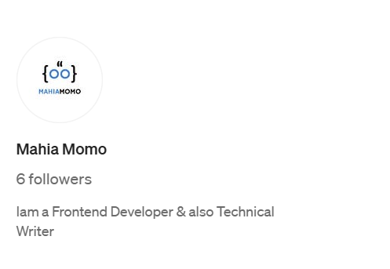

  

 <h1 align="center">
    
</h1>

  

   

<h3 align="center"> A Frontend Developer</h3> 

 

 🎓 I’m currently studying Computer Science and Engineering (CSE).

 🔭 I’m currently working on **Smith Portfolio**
 
 🌱 I’m currently learning **python, django, react**

💬 Ask me about **html, css, Javascript ... or anything**

⚡ Fun fact **I'm Lazy but Smart**

 

 
 
  
  

<h2 align="center">⚒️ Languages-Frameworks-Tools ⚒️</h2>
 

    
     

 

## 🌐 Socials:

<picture>
  <source
    media="(prefers-color-scheme: dark)"
    srcset="https://raw.githubusercontent.com/platane/snk/output/github-contribution-grid-snake-dark.svg"
  />
  <source
    media="(prefers-color-scheme: light)"
    srcset="https://raw.githubusercontent.com/platane/snk/output/github-contribution-grid-snake.svg"
  />
  
</picture>

# ⚡Git Stats ⚡

  
  
   
  

  

 

  <table>
  <tr>
    <td align="left">
      <h3>🌠 Leetcode</h3>
      

        
      

    </td>
    <td align="right">
      <h3>🌌 Codeforces</h3>
      

        
      

    </td>
  </tr>
  </table>

 <!-- Footer -->

<!-- Footer -->

<!-- Blog Section -->

<h2>✍🏻 Read My Blogs on [ 
<a href="https://medium.com/@mahiamomo12" target="_blank" rel="noopener noreferrer">Medium</a>, 
<a href="https://dev.to/mahiamomo" target="_blank" rel="noopener noreferrer">Dev.to</a>, 
<a href="https://mahiamomo.hashnode.dev" target="_blank" rel="noopener noreferrer">Hashnode</a>
]</h2>

<table border="0" width="100%" style="max-width: 900px;">
  <tr valign="top">
    <td width="60%" style="padding-right: 20px;">
      
    </td>
    <td width="40%">
      
    </td>
  </tr>
</table>

 

| **Blog Name** | **Platform** | **Link** |
|:-------------:|:------------:|:--------:|
| Use Wakatime and Initialize Your Coding Time | Dev.to | [👉 Read](https://dev.to/mahiamomo/use-wakatime-and-initialize-your-coding-time-5h6k) |
| DOM কী? DOM নিয়ে কিছু মৌলিক ধারণা ! | Medium | [👉 Read](https://medium.com/@mahiamomo12/dom-%E0%A6%95%E0%A7%80-dom-%E0%A6%A8%E0%A6%BF%E0%A7%9F%E0%A7%87-%E0%A6%95%E0%A6%BF%E0%A6%9B%E0%A7%81-%E0%A6%AC%E0%A7%87%E0%A6%B8%E0%A6%BF%E0%A6%95-%E0%A6%95%E0%A6%A5%E0%A6%BE-b009b4427f0c) |
| How I Hacked My Brain to Crave Coding Every Day | Hashnode | [👉 Read](https://mahiamomo.hashnode.dev/how-i-hacked-my-brain-to-crave-coding-every-day) |
| 16 Essential Qualities That Prove You Are a Skilled Programmer | Hashnode | [👉 Read](https://mahiamomo.hashnode.dev/16-essential-qualities-that-prove-you-are-a-skilled-programmer) |
| Does Sass Offer the Features of a Programming Language? | Dev.to | [👉 Read](https://dev.to/mahiamomo/is-saas-giving-us-the-flavour-of-programming-language-2jo4) |

<!-- BLOG-POST-LIST:START -->
- [use-wakatime-and-initialize-your-coding-time](https://dev.to/mahiamomo/use-wakatime-and-initialize-your-coding-time-5h6k)
- [DOM কী? DOM নিয়ে কিছু মৌলিক ধারণা !](https://medium.com/@mahiamomo12/dom-%E0%A6%95%E0%A7%80-dom-%E0%A6%A8%E0%A6%BF%E0%A7%9F%E0%A7%87-%E0%A6%95%E0%A6%BF%E0%A6%9B%E0%A7%81-%E0%A6%AC%E0%A7%87%E0%A6%B8%E0%A6%BF%E0%A6%95-%E0%A6%95%E0%A6%A5%E0%A6%BE-b009b4427f0c)
- ["How I Hacked My Brain to Crave Coding Every Day"](https://mahiamomo.hashnode.dev/how-i-hacked-my-brain-to-crave-coding-every-day)
- ["16 Essential Qualities That Prove You Are a Skilled Programmer”](https://mahiamomo.hashnode.dev/16-essential-qualities-that-prove-you-are-a-skilled-programmer)
- ["Does Sass Offer the Features of a Programming Language?"](https://dev.to/mahiamomo/is-saas-giving-us-the-flavour-of-programming-language-2jo4)
<!-- BLOG-POST-LIST:END -->

  

<!-- Blog Section -->

## 🏆 GitHub Trophies

### ✍️ Random Dev Quote

 
Donate if you wish to support 💗: 
**[[Bkash - Rocket](https://forms.gle/osWQmMzD166o2LdS7)] [[Buy Me a Book](https://www.buymeacoffee.com/sumontasahi)]**

